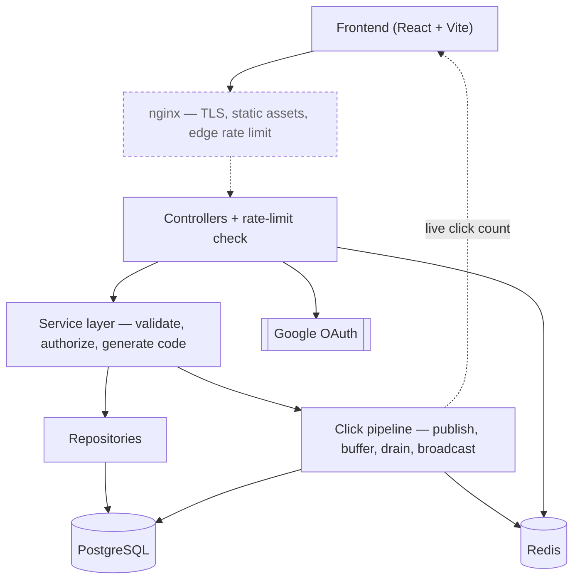
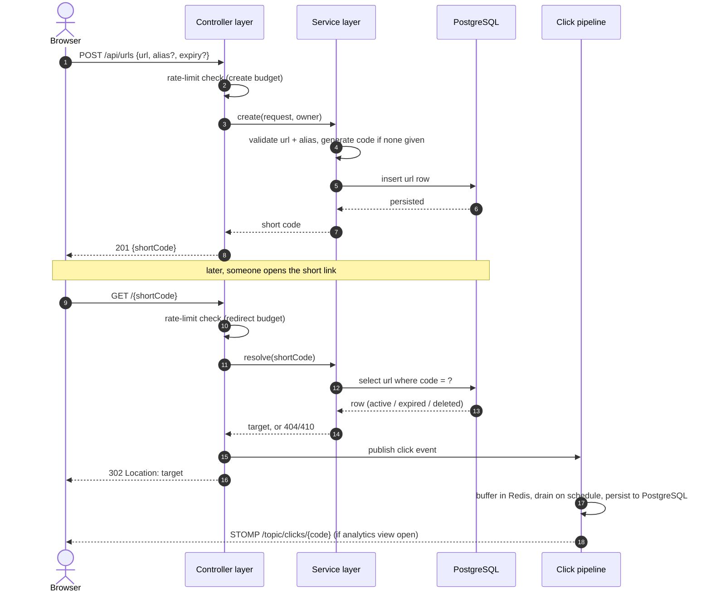

# High-level design

Companion diagrams for [`overview.md`](./overview.md) §3. Component names and
event ordering are taken from the actual package structure
(`com.urlshortener.controller`, `.service`, `.event`, `.ratelimit`) — see
[`decisions.md`](./decisions.md) for the specific class inside each layer and why
it exists.

## Components

Dashed = Phase 2 (scoped, not built — [`requirements.md`](./requirements.md) §6).
Each box is a layer, not a single class.

## Request flow

The two flows an interviewer will actually trace: creating a link, and what happens
when someone visits it.

